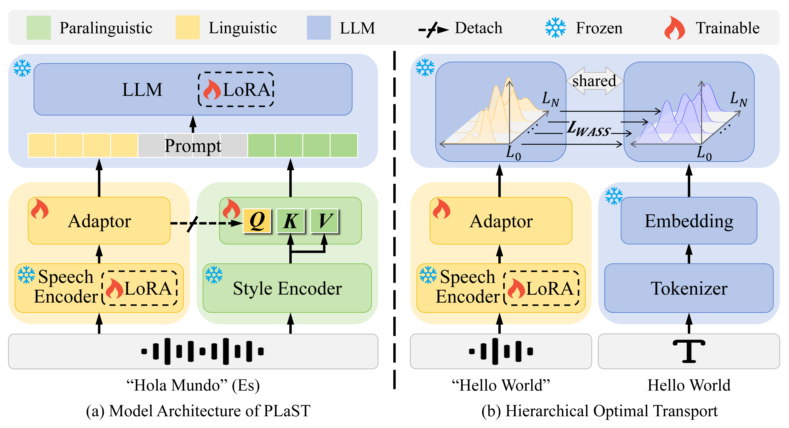

# PLaST: Towards Paralinguistic-aware Speech Translation

> Thanks to the excellent prior work [LLaST](https://github.com/openaudiolab/LLaST) and the [xtuner](https://github.com/InternLM/xtuner) framework, whose open-source contributions provide essential foundations for this project. More details will be released progressively.


## Overview

This work proposes **PLaST**, a dual-branch framework that explicitly models paralinguistic cues beyond lexical content. By separating and coordinating linguistic and paralinguistic representations, PLaST improves speech translation quality in both paralinguistic-sensitive and standard ST scenarios.



PLaST consists of three key components:

- **Dual-branch encoding**  
  We use a speech encoder to extract linguistic representations and a style extractor to independently model paralinguistic information.

- **Hierarchical Optimal Transport (OT) alignment**  
  To obtain a purified linguistic representation aligned with text semantics, we apply hierarchical OT over layer-wise outputs of an LLM decoder, enforcing structured alignment between speech and text representations.

- **Attention-based Retrieval (AR) for paralinguistic cues**  
  Paralinguistic information is retrieved and refined via an AR module, where linguistic representations act as queries to guide paralinguistic attention for joint semantic understanding and translation generation.

## Results

On the paralinguistic-sensitive benchmark **ContraProST**, PLaST achieves strong directional and global contrastive likelihood scores across multiple language pairs, demonstrating effective perception and utilization of paralinguistic cues.

| Model        | German (Dir.) | German (Glob.) | Spanish (Dir.) | Spanish (Glob.) | Japanese (Dir.) | Japanese (Glob.) |
|--------------|---------------|----------------|----------------|-----------------|------------------|------------------|
| **PLaST-2B** | **65.5**      | **15.4**       | **66.3**       | **13.6**        | **63.1**         | **13.3**         |

On the standard benchmark **CoVoST-2**, PLaST maintains competitive BLEU performance across diverse language directions, showing good generalization to typical speech translation settings.

| Model        | French | Japanese | German | Chinese | Spanish | Italian |
|--------------|--------|----------|--------|---------|---------|---------|
| **PLaST-2B** | 41.6   | 24.8     | 37.4   | 19.7    | 43.3    | 39.7    |
| **PLaST-8B** | 44.3   | 27.8     | 40.9   | 24.8    | 45.5    | 42.6    |


## Model List

| Model | Speech Encoder | Style Encoder | LLM |
|-------|---------------|---------------|-----|
| PLaST-2B | Whisper-Large | emotion2vec+base | TinyLlama |
| PLaST-8B | Whisper-Large | emotion2vec+base | Llama2-7B-Instruct |

## Data Preparation

- Download data from [CommonVoice](https://commonvoice.mozilla.org/en/datasets) and [ContraProST](https://github.com/apple/ml-speech-is-more-than-words)

- Prepare tsv and audio data as follows:
```
covost2/
├── tsv/
│   ├── covost_v2.de_en.dev.tsv
│   └── covost_v2.de_en.test.tsv
└── audio/
    ├── de/
    ├── en/
    ├── es/
    ├── fr/
    ├── it/
    ├── ja/
    └── zh-CN/

contrap/
├── tsv/
│   ├── contrap.en_de.dev.tsv
│   └── contrap.en_de.test.tsv
└── audio/
    └── en/
```

## Training & Evaluation

1. Install xtuner


```bash
conda create --name xtuner-env python=3.10 -y
conda activate xtuner-env

cd xtuner
pip install -e '.[all]'
```


2. train / evaluate by scripts

We provide training and evaluation scripts in the `scripts/` directory, with configurations and runtime settings defined under `workspace/`.

| Model Scale | Training | Evaluation |
|------------|----------|------------|
| **2B** | [`scripts/train_plast_2b.sh`](./scripts/train_plast_2b.sh) | [`scripts/test_plast_2b.sh`](./scripts/test_plast_2b.sh) |
| **8B** | [`scripts/train_plast_8b.sh`](./scripts/train_plast_8b.sh) | [`scripts/test_plast_8b.sh`](./scripts/test_plast_8b.sh) |

